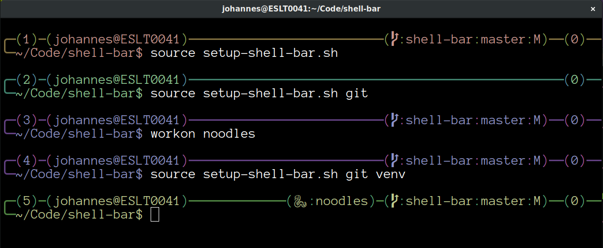

Shell-bar
=========

Shell-bar is a small program that draws a pretty bar in your shell prompt.
Currently this has only been tested with Bash. The bar gets a random colour for
each terminal window. This has been tested to work on the following terminals:

* gnome-terminal 3.22
* konsole 16.12
* xfce4-terminal 0.8.3
* xterm 327
* rxvt-unicode-256color 9.22 (with `-oldterm`)
* terminology 0.9.1 (with `-oldterm`)
* mate-terminal 1.12.1 (with `-oldterm`, true-colour support should be in v1.16)



Build
-----

Shell-bar compiles with GCC 5, 6, and 7. Just type `make`.

Install
-------

Edit the `Makefile` to set your install prefix. Then run

```bash
make install
```

To see an example of how to enable `shell-bar` in your `.bashrc`, see below.

Additional info scripts
-----------------------

This distribution currently has two extra scripts:

* git
* Python VirtualEnv

And a helper script to setup the shell-bar with the desired plugins. If you
create additions of your own, share, pull-request!

Example section in `.bashrc`
----------------------------

        case "$TERM" in
        rxvt*)
                export VIRTUAL_ENV_DISABLE_PROMPT=1
                source setup-shell-bar.sh time return-value git
                ;;
        xterm*|x-term*)
                export VIRTUAL_ENV_DISABLE_PROMPT=1
                source setup-shell-bar.sh time return-value venv git
                ;;
        *)
                PS1="[\[\e[1m\]\#\[\e[m\]]-[\[\e[32m\]\u@\h\[\e[m\]]"
                PS1+="-[\[\e[1;34m\]\w\[\e[m\]$ "
                ;;
        esac

Anaconda Users
--------------
For the correct display of anaconda virtual environments it is best to add to
or create a `.condarc` file in your home directory.

Add the following line:
```
changeps1: False
```
